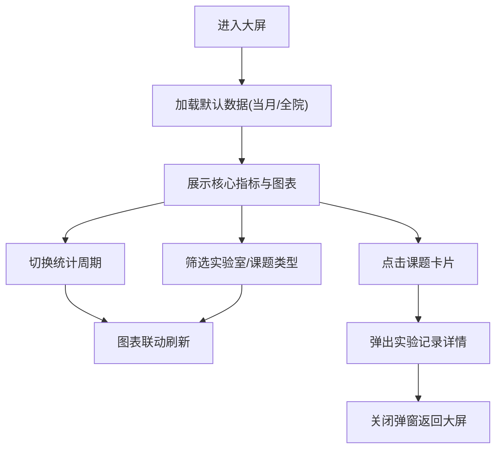

## 1. 产品概述

3836 全屏可视化大屏是科研院所的核心数据展示平台，聚合展示各实验室仪器使用、项目进度、实验产出等关键指标，帮助管理层快速掌握科研运行态势。

- 核心价值：一屏统览全院科研运行数据，辅助决策与资源调配
- 目标用户：科研管理人员、实验室负责人、课题组长

## 2. 核心功能

### 2.1 功能模块
1. **核心指标区**：实验产出总量、仪器使用率、在研课题数、耗材消耗金额
2. **分区图表区**：各实验室仪器日均使用时长柱状图
3. **项目产出区**：项目阶段性产出数量趋势图
4. **耗材消耗区**：耗材消耗速率折线图
5. **设备热力区**：热门实验设备使用频次热力图
6. **课题卡片区**：在研课题列表，低产出课题自动标黄
7. **详情弹窗**：点击课题卡片查看细分实验记录
8. **周期切换**：支持按月/季度切换统计周期
9. **筛选功能**：界面筛选，无文件导入导出

### 2.2 页面详情
| 页面名称 | 模块名称 | 功能描述 |
|-----------|-------------|---------------------|
| 可视化大屏 | 顶部指标栏 | 展示4项核心KPI，数字动效 |
| 可视化大屏 | 仪器使用时长 | 分区柱状图，按实验室分组 |
| 可视化大屏 | 项目产出趋势 | 堆叠柱状图，按阶段分类 |
| 可视化大屏 | 耗材消耗速率 | 折线图，展示消耗趋势 |
| 可视化大屏 | 设备热力图 | 矩阵热力图，设备×时间段 |
| 可视化大屏 | 课题列表 | 卡片式布局，低产出标黄 |
| 可视化大屏 | 实验记录弹窗 | 点击课题查看详细实验记录 |
| 可视化大屏 | 周期切换器 | 月/季度切换，影响全部图表 |
| 可视化大屏 | 筛选控件 | 实验室、课题类型筛选 |

## 3. 核心流程

用户进入大屏后，默认展示当月全院数据概览。用户可切换统计周期或筛选条件，所有图表联动更新。点击课题卡片可下钻查看该课题的详细实验记录。

## 4. 用户界面设计

### 4.1 设计风格
- 主色调：深空蓝 `#0a1628` 背景，科技蓝 `#00d4ff` 主色
- 辅助色：青色 `#00ffcc`、橙色预警 `#ffb800`、低产出标黄 `#ffd93d`
- 字体：数字用等宽字体，标题用粗体无衬线字体
- 布局：网格布局，卡片式分区，科技感边框装饰
- 图标风格：线性图标，与主色一致
- 整体风格：科技感、数据驱动、深色大屏风格

### 4.2 页面设计概述
| 页面名称 | 模块名称 | UI 元素 |
|-----------|-------------|-------------|
| 可视化大屏 | 顶部指标栏 | 渐变数字、图标、增长趋势箭头 |
| 可视化大屏 | 图表卡片 | 发光边框、标题栏、渐变背景 |
| 可视化大屏 | 课题卡片 | 悬停上浮、低产出黄色光晕 |
| 可视化大屏 | 周期切换 | 胶囊式切换按钮 |
| 可视化大屏 | 详情弹窗 | 半透明毛玻璃背景、入场动画 |

### 4.3 响应式
- Desktop-first 设计，面向大屏展示
- 支持 1920×1080 及以上分辨率
- 最低适配 1366×768

### 4.4 动效设计
- 数字滚动动画
- 图表渐入动画
- 卡片悬停微交互
- 数据刷新过渡效果
