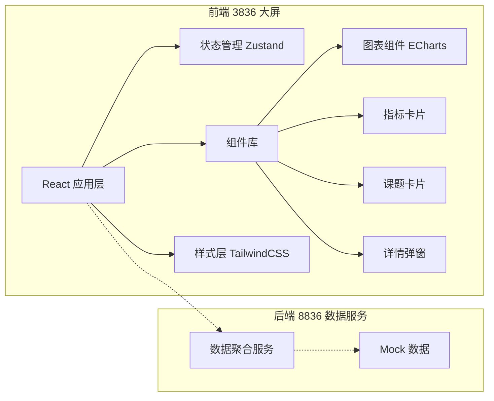

## 1. 架构设计



## 2. 技术说明

- 前端：React@18 + TypeScript + Vite
- 样式：TailwindCSS@3
- 图表：ECharts@5
- 状态管理：Zustand
- 图标：lucide-react
- 数据：Mock 数据模拟（前端内置，对接 8836 服务数据格式）

## 3. 路由定义

| 路由 | 用途 |
|-------|---------|
| / | 可视化大屏主页面 |

## 4. 数据模型

### 4.1 核心指标
```typescript
interface CoreMetrics {
  totalExperiments: number;
  instrumentUtilization: number;
  activeProjects: number;
  consumableCost: number;
  experimentGrowth: number;
  utilizationGrowth: number;
  projectGrowth: number;
  costGrowth: number;
}
```

### 4.2 仪器使用数据
```typescript
interface InstrumentUsage {
  labName: string;
  avgDailyHours: number;
  instrumentCount: number;
}
```

### 4.3 项目产出数据
```typescript
interface ProjectOutput {
  period: string;
  papers: number;
  patents: number;
  reports: number;
  prototypes: number;
}
```

### 4.4 耗材消耗数据
```typescript
interface ConsumableUsage {
  date: string;
  cost: number;
  quantity: number;
  category: string;
}
```

### 4.5 设备热力数据
```typescript
interface HeatmapData {
  equipment: string;
  timeSlot: string;
  frequency: number;
}
```

### 4.6 课题数据
```typescript
interface Project {
  id: string;
  name: string;
  labName: string;
  leader: string;
  progress: number;
  outputCount: number;
  lowOutput: boolean;
  startDate: string;
  endDate: string;
  category: string;
  experimentRecords: ExperimentRecord[];
}

interface ExperimentRecord {
  id: string;
  date: string;
  name: string;
  instrument: string;
  duration: number;
  operator: string;
  result: string;
}
```

### 4.7 筛选条件
```typescript
interface FilterState {
  period: 'month' | 'quarter';
  lab: string;
  category: string;
}
```

## 5. 项目结构

```
src/
├── components/
│   ├── Dashboard/
│   │   ├── CoreMetrics.tsx      # 核心指标栏
│   │   ├── InstrumentUsageChart.tsx  # 仪器使用时长图
│   │   ├── ProjectOutputChart.tsx    # 项目产出图
│   │   ├── ConsumableChart.tsx       # 耗材消耗图
│   │   ├── EquipmentHeatmap.tsx      # 设备热力图
│   │   ├── ProjectCardList.tsx       # 课题卡片列表
│   │   ├── ProjectDetailModal.tsx    # 课题详情弹窗
│   │   ├── PeriodSwitcher.tsx        # 周期切换器
│   │   └── FilterBar.tsx             # 筛选栏
│   └── common/
│       ├── MetricCard.tsx            # 指标卡片
│       ├── ChartCard.tsx             # 图表卡片容器
│       └── ProjectCard.tsx           # 课题卡片
├── store/
│   └── useDashboardStore.ts     # 大屏状态管理
├── data/
│   └── mockData.ts              # Mock 数据
├── types/
│   └── index.ts                 # 类型定义
├── pages/
│   └── Dashboard.tsx            # 大屏主页
├── App.tsx
├── main.tsx
└── index.css
```
